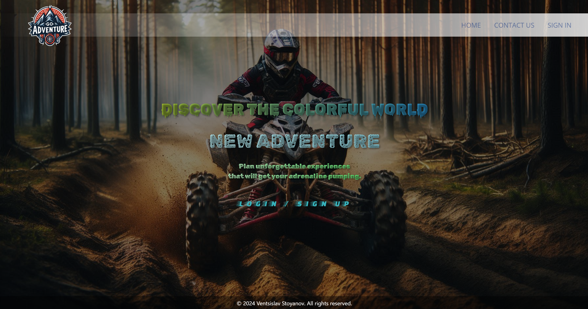
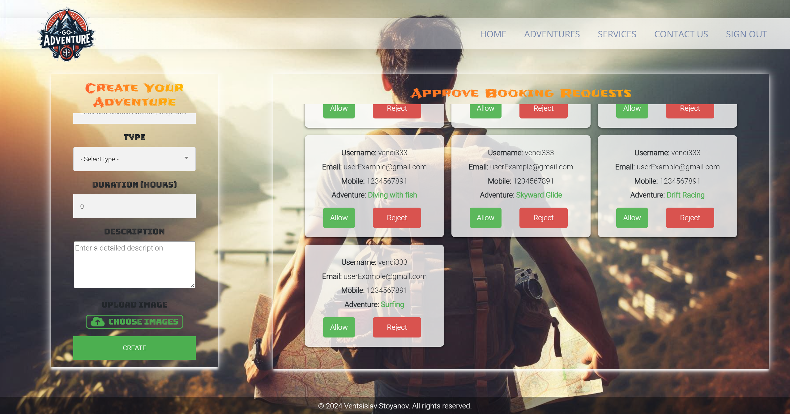
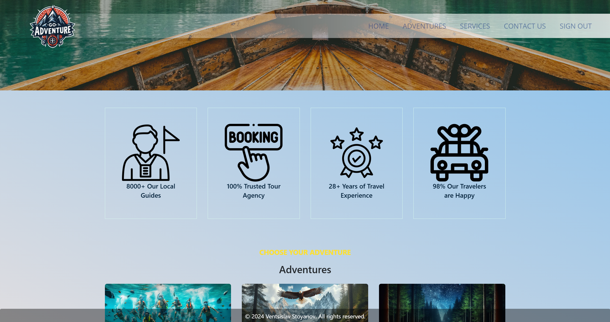

# SpeedyWheels - Spring MVC Application

<div align="center">
  <a href="https://github.com/VStoqnov7/GoAdventure">
    
  </a>
    <h2>GoAdventure</h2>
</div>

# Installation

### Prerequisites:

- JDK 17
- Apache Maven 3.9.7 or higher

_To set up and run GoAdventure, you need to:_

Set up environment variables `${MYSQL_HOST}, ${MYSQL_PORT}, ${MYSQL_USER}, ${MYSQL_PASSWORD}, ${MAIL_USER}, ${MAIL_PASSWORD}, ${CLOUDINARY_NAME}, ${CLOUDINARY_API_KEY}, ${CLOUDINARY_API_SECRET}, ${ADMIN_USERNAME}, ${ADMIN_PASSWORD}, ${ADMIN_EMAIL}, ${ADMIN_PHONE_NUMBER}, ${HOST}, ${PORT}`

```yaml
spring.datasource.url: jdbc:mysql://${MYSQL_HOST}:${MYSQL_PORT}/goadventure?allowPublicKeyRetrieval=true&useSSL=false&createDatabaseIfNotExist=true
spring.datasource.username: ${MYSQL_USER}
spring.datasource.password: ${MYSQL_PASSWORD}
spring.mail.username: ${MAIL_USER}
spring.mail.password: ${MAIL_PASSWORD}
cloudinary.name: ${CLOUDINARY_NAME}
cloudinary.api-key: ${CLOUDINARY_API_KEY}
cloudinary.api-secret: ${CLOUDINARY_API_SECRET}
admin.username: ${ADMIN_USERNAME}
admin.password: ${ADMIN_PASSWORD}
admin.email: ${ADMIN_EMAIL}
admin.phone: ${ADMIN_PHONE_NUMBER}
app.mysql.host: ${HOST}
app.mysql.port: ${PORT}
```

# Built With

- 
- 
- 
- 
- 
- 
- 
- 
- 
- 

# Testing

- 
- 

# Mapping

This project uses the **`ModelMapper`** library for automatic data conversion between DTOs (Data Transfer Objects) and entity classes. This library simplifies the mapping process, reducing the need for repetitive code and making the application more readable and maintainable. ModelMapper provides flexibility in configuring the mapping, allowing easy and complex data transformations when needed.

# About The Project

_Our platform is dedicated to connecting adventure seekers with exciting outdoor experiences. Whether you're looking to explore hiking trails, try thrilling water sports, or embark on unique adventure tours, we offer an easy and efficient way to discover and book your next adventure. Our goal is to make outdoor activities accessible, safe, and enjoyable for everyone.-_

### -Guest page-

_This is the home page accessible to all users, including those who are not registered. For those interested in booking an adventure, there is a button that leads to the registration or login page, allowing users to create an account or access their profile. Additionally, the background changes dynamically, enhancing the user experience._




<hr/>

### -Contact us-

_This page allows users to send a message to the site administrator. The form requires users to fill in basic details and checks whether all fields are completed._

**Backend Validations:**

- **Full Name:** _Checks that the full name field is not empty._
- **Email Address:** _Validates that the email field is not empty and follows a valid email format._
- **Subject:** _Ensures that the subject field is not left blank._
- **Message:** _Confirms that the message field is filled out._
- **Message Sending:** _After successful validation, the message is sent to the administrator’s email address, which is specified in the configuration:_

```yaml
admin.email=${ADMIN_EMAIL}
```

_The message is sent from the following email credentials:_

```yaml
spring.mail.username: ${MAIL_USER}
spring.mail.password: ${MAIL_PASSWORD}
```


_This section displays only the first 4 available listings on the site. Each listing contains a title, description, price, image, and a "Book Now" button, which takes users to the details page of the listing._

- **Displaying Listings:** _The section shows only the first 4 available listings, which can be viewed by all users. The listings contain key information such as titles, prices, brief descriptions, and an image._
- **Book Now" Button:** _Each listing includes a "Book Now" button, which redirects the user to the page with the detailed view of that specific listing._
- **For Non-Authenticated Users:** _If the user is not logged in, the "Book Now" button will redirect them to the login page, allowing them to sign in before they can access the listing details._
- **Authenticated Users:** _Logged-in users will have full access to the detailed listing page._


<hr/>

### -Register-

_This page allows users to create a new account on our platform. The registration form includes several backend validations to ensure data integrity and security._

**Backend Validations:**

- **Username:** _Checks if the username is unique and not already registered on the platform. Usernames must be between 5 and 20 characters long._
- **Password:** _Ensures that the password field meets the length requirements of 5 to 20 characters._
- **Email:** _Validates that the email is unique and follows the standard email format._
- **Phone Number:** _Verifies that the phone number contains exactly 10 digits._


<hr/>

### -Login-

_This page allows users to log into their existing accounts on our platform. The login form includes backend validations to ensure that the provided credentials are correct._

**Backend Validations:**

- **Email and Password:** _Verifies that both the email and password fields are correctly filled in. If the provided credentials do not match any registered account, an error message will notify the user of an authentication failure._


<hr/>

### -Verification Page-

_This page is designed for confirming the user's registration in the application. After the user completes the registration form, an email is sent with a special confirmation link. The verification page contains information and a button that the user can click to activate their account._

- **Email Sending:** _When the user registers, an email is sent with a unique token, which is used to verify the user’s registration._
- **Using the Token:** _The user opens the link in the email and is redirected to the verification page. The link contains a token that the application uses to confirm the registration._
- **Verification Page:** _On the page, the user sees the "Confirm Your Account" button. When clicked, the system checks whether the token is valid._
- **Status Update:** _If the token is valid, the user’s account is activated, and they are redirected to the home page._
- **Backup Link:** _In case the user cannot click the button, a text link is provided that can be copied and pasted into the browser._


<hr/>

### -Login as Administrator-

_This page is specifically designed for logged-in administrators. It serves as a central hub where admins can access various administrative features and manage platform settings._

_Only users with the Administrator role can:_

- _Create new adventures._
- _Delete adventures._
- _Approve or reject adventure booking requests._





<hr/>

### -Login as User-

_This is the Home page that logged-in users access upon successful authentication. This page displays selected adventures for logged-in users, providing the option to view more details for each adventure._

- **This is the home page with no adventures:**


- **This is the home page with adventures:**


<hr/>

### -Adventures-

_The adventure page provides users with the ability to search for adventures by city and type of adventure. It includes the following key features:_

- **Search by City and Adventure Type:** _Users can enter the name of a city in the text field and select the type of adventure from a dropdown menu. After clicking the search button, the system will display all available adventures that match the specified criteria._


- **View Results:** _If any adventures are found, they will be displayed on the page with details such as photos, description, price, and duration information. Each adventure has a link for further details, leading to its individual page._


- **Message When No Results Are Found:** _If no adventures are found, a message will be displayed: "No adventures found. Try adjusting the filter or search in a different location."_


- **Information About Services:** _The page also includes a section for offered services such as local guides, agency trust, travel experience, and traveler satisfaction._



- **Pagination:** _If there are many results, they will be divided into pages to make navigation easier. Users can navigate between pages using "Next" and "Previous" buttons or select a specific page from the list._
- **Informational Video for Adventures:** _At the end of the page, there will be an option to watch a short video showcasing part of the experiences in specific adventures. This will help users get visual content and make a more informed decision._


<hr/>

### -Adventure profile-

_This page displays detailed information about a specific adventure, allowing users to view pictures, details, and make a reservation request._

- **Image Carousel:** _Displays a gallery of images related to the adventure, allowing users to browse visually._
- **Adventure Details:** _Showcases key information, including the name, location, type, duration, and a brief description of the adventure._
- **Reservation Request:** _Users can submit a reservation request by selecting a preferred date. Validation ensures the date is in the future._
- **Modal Windows:** _Modal windows: Informs users of errors (e.g. invalid date) or the success of their booking request._


<hr/>

### -Error page-

_This page is designed to notify users when they encounter an unavailable or non-existent page, delivering a visually impactful experience._

- **Error Message:** _Displays a bold and eye-catching "Page Not Found" message to inform users of the error._
- **Go Back Option:** _Includes a "Go Back" button that allows users to easily return to the previous page with a single click._


<hr/>
